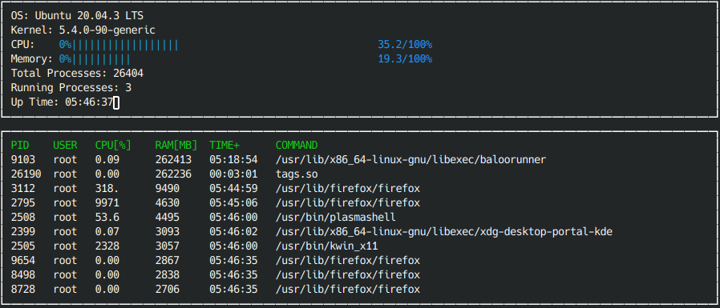

# CppND-System-Monitor Project

The System Monitor project is the second of the several projects within the Udacity C++ Nanodegree course.  

The original temple Source Course is clone from [Udacity C++ Nanodegree Program](https://www.udacity.com/course/c-plus-plus-nanodegree--nd213). 

The screenshot below shows my implementation of the code running on my station.  

My implementation sort process by memory use, descending order.

---

## Compilation

This code was compiled and tested using Ubuntu 20.04.3 LTS.  Before compiling this code, it is necessary to 
have installed the gcc build-essential and armadillo packages as shown in the steps below:

* sudo apt install build-essential
* sudo apt-get install libarmadillo-dev

To compile the code, simple execute the command make build.

To run the app, execute from the command prompt ./build/monitor.

To terminate the app, press Ctrl+c while in the running window.